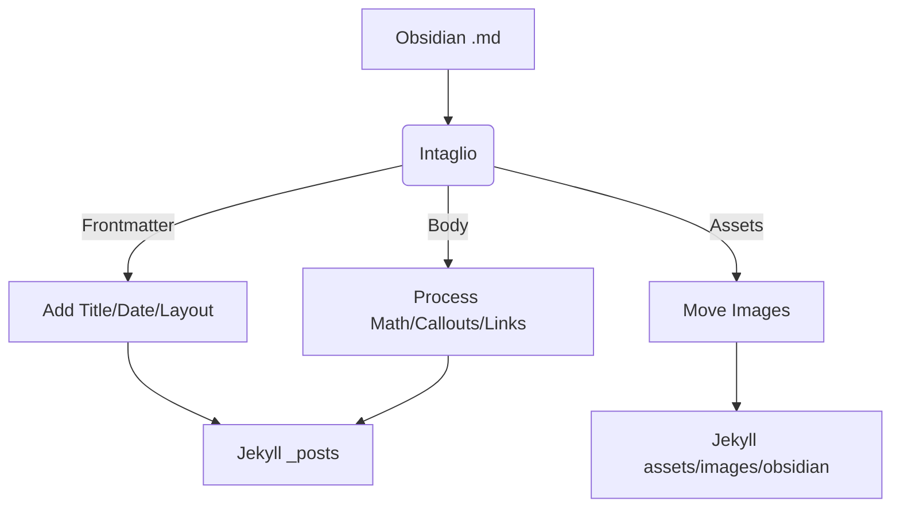

# User Guide

## Table of Contents

1. [Writing Guidelines](#writing-guidelines)
2. [Installation and Setup](#installation-and-setup)
3. [Advanced Configurations](#advanced-configurations)
   - [CLI Commands](#cli-commands)
   - [Running With No Command](#running-with-no-command)
   - [Environment Variables](#environment-variables)
4. [How it Works](#what-this-tool-does)
   - [Frontmatter](#1-adds-title-and-layout-to-frontmatter)
   - [Dates & Renaming](#2-prepends-dates-before-file-names)
   - [Images](#3-copies-associated-images-to-a-dedicated-folder-and-updates-embedded-image-links)
   - [Internal Links](#4-updates-internal-links)
   - [Math](#5-process-math)
   - [Callouts](#6-supports-callouts)

## Writing Guidelines

Just write normally! You don't need to manually configure the frontmatter, beyond `share: true` and `date`. The tool grabs your `h1` as the `title` and adds `layout` for you.

Set `date` yourself rather than letting the tool fall back to the file's creation date. [See below](#2-prepends-dates-before-file-names) for what might go wrong otherwise.

If you wish, you can add additional settings or override the default in the frontmatter. Your configurations such as `title`, `date`, `slug`, or `permalink` will not be overridden by this tool.

## Installation and Setup

### Install

```bash
uv tool install git+https://github.com/kckhchen/intaglio@v1
```

This installs an `intaglio` command onto your PATH in its own isolated environment. If your shell can't find the command afterwards, run `uv tool update-shell` and open a new terminal.

`@v1` follows the latest 1.x release; use a full tag such as `@v1.5.0` to pin an exact version. To upgrade later:

```bash
uv tool upgrade --reinstall intaglio
# or if you prefer pipx:
# pipx install git+https://github.com/kckhchen/intaglio@v1
```

### The `.intagliorc` File

From the root of your **Jekyll site**, run `intaglio init`. This writes a commented `.intagliorc`. The only setting you need is the path to your vault:

```bash
# .intagliorc
VAULT_DIR="/path/to/obsidian/vault"
# or exported as environment variable with
# export VAULT_DIR="/path/to/obsidian/vault"
```

`JEKYLL_DIR` defaults to wherever `.intagliorc` lives, so you don't need to set it. Run `intaglio` from that directory or any subdirectory of it.

> [!note]
> `.intagliorc` contains the absolute path to your vault and exposes your username. Consider adding `.intagliorc` to your `.gitignore`, or, if you wish to carry the config file around, you can export `VAULT_DIR` as environment variable.

> [!important]
> Earlier versions used a `.env` file. It is still read, but is deprecated and will warn on every run. Rename it to `.intagliorc`.

You can override the settings in `.intagliorc` either with environment variables or temporarily with CLI flags. CLI flags takes precedence over everything else. The tool automatically resolves the config. To see which config source is at work for each variable, use the command:

```bash
intaglio config
```

> [!note]
> **A Note on Styling**: The first time you run the tool, it will create `_includes/obsidian-callouts.html` in your Jekyll repository. This file handles the icons and colors for your callouts. Feel free to customize it.

### Available Flags

`intaglio --help` lists every command, and `intaglio <command> --help` lists the flags for one. The full list is [below](#cli-commands).

Neither your original Obsidian notes nor hand-authored posts on your Jekyll site are ever touched when you run `intaglio update`: cleanup only removes files carrying the tool's own `generator: intaglio` frontmatter marker.

> [!note]
> Running `intaglio` with no command still means `intaglio run`. At a terminal it first shows which vault and site it is about to touch and asks you to confirm; in a script or CI it just runs.

## Advanced Configurations

### CLI Commands

| Command           | What it does                                                 |
| ----------------- | ------------------------------------------------------------ |
| `intaglio run`    | Processes shared posts from the vault into the Jekyll site.  |
| `intaglio update` | Runs `run`, then removes stale posts and images.             |
| `intaglio clean`  | Removes stale posts and images only, without processing.     |
| `intaglio init`   | Writes a commented `.intagliorc` in the current directory.   |
| `intaglio config` | Prints the resolved settings and where each value came from. |

Run `intaglio --help` for the list, or `intaglio <command> --help` for one command's flags.

You can clean up removed or outdated posts and images that are no longer referenced by any posts with `clean` without processing new posts:

```bash
intaglio clean
```

You will see a list of files to be removed and be prompted to confirm. Only stale posts generated by this tool will be removed. If you have other handwritten posts on the Jekyll site, they will stay intact.

If you wish to process new posts and clean up stale posts at the same time, use `update` instead.

For automation, `-y`/`--yes` skips the confirmation prompt. It applies to both `update` and `clean`.

```bash
intaglio update --yes
```

You can also start a dry run first:

```bash
intaglio run --dry
```

This will print all the actions taken in the terminal but will not execute any.

The default layout is `post`. You can change it with the `--layout` flag:

```bash
intaglio run --layout YOUR_LAYOUT
```

Alternatively, add the layout in the frontmatter and the tool will respect the configuration, and this will take precedence over the flag.

The tool uses the modification date to decide whether to process a post. If you would like to force processing a post, you can use the `-f`/`--force` flag. This is useful when you modify the scripts or download a new release and wish all posts to be updated.

```bash
intaglio run --force
```

To process a single post, pass its name (not its relative path) to `--only`:

```bash
intaglio run --only "My Post.md"
```

### Running With No Command

Typing `intaglio` on its own still means `intaglio run`, so existing scripts and cron jobs keep working. The behaviour depends on where it runs:

- **At a terminal**, it prints the vault and site it is about to touch and asks for confirmation, defaulting to no. This is so that trying the command out of curiosity never modifies your site by accident.
- **In a script, cron job, or CI**, it runs without asking.
- **With no vault configured**, it prints the help text and points you at `intaglio init`.

Passing any flag, such as `intaglio --force`, counts as an explicit request and skips the confirmation.

> [!note]
> Earlier versions used flags instead of commands (`--cleanup`, `--update`, `--init`, `--show-config`). They still work and map onto the commands above, but print a deprecation warning and will be removed in a future release.

### Environment Variables

| Variable                 | Description                                                                                                                                                                           | Default                   |
| ------------------------ | ------------------------------------------------------------------------------------------------------------------------------------------------------------------------------------- | ------------------------- |
| `VAULT_DIR`              | Absolute path to your Obsidian vault. Required; there is no sensible default.                                                                                                         | —                         |
| `JEKYLL_DIR`             | Absolute path to your Jekyll site.                                                                                                                                                    | where `.intagliorc` lives |
| `MATH_RENDERING_MODE`    | `metadata` adds `math: true` to frontmatter; `inject_cdn` injects MathJax CDN at the end of post. For details [see below](#5-process-math)                                            | `inject_cdn`              |
| `PREVENT_DOUBLE_BASEURL` | `True` to prevent double baseurl problem in Jekyll >= 4.0. [See Why](#4-updates-internal-links)                                                                                       | `False`                   |
| `IMG_FOLDER`             | Path to the image folder on your Jekyll site. It is recommended that you set a dedicated folder for images processed by this tool and prevent using generic path e.g. `assets/images` | `assets/images/obsidian`  |
| `POST_FOLDER`            | Path to the post folder on your Jekyll site. Some themes might have a different path like `_articles`, but generally they'll be at `_posts`                                           | `_posts`                  |
| `INCLUDES_FOLDER`        | Path to the includes folder on your Jekyll site. This is where `obsidian-callouts.html` will be stored.                                                                               | `_includes`               |

### Frontmatters

All configurations manually added in the frontmatter will not be overridden by this tool.

### Un-publish

To un-publish a post, simply toggle `share: false` or completely remove `share` in the frontmatter and run `intaglio clean` or `intaglio update`.

## What This Tool Does

The tool automatically does the following things to your posts:

### 1. Adds `title` and `layout` to Frontmatter

The tool automatically adds `layout: post` (or any layout format of your choice) to signal Jekyll which layout to use. It will also looks for the first `h1`, treats it as the title, and sets the `title` accordingly in the frontmatter, after which it will remove the `h1` to prevent duplicate titles. This allows you to use `h1` as you normally would.

If no `h1` is present, `title` won't be added and Jekyll will generate a title based on the file name. You can also manually add `title` to the frontmatter.

It also adds a signature `generator: intaglio` to the frontmatter. The tool only manages posts with this line in the frontmatter, so your other posts stay invisible to the tool and will not be touched when you run `intaglio clean` or `intaglio update`.

### 2. Prepends Dates Before File Names

If you have set `date` (in the form of `yyyy-mm-ddXXXXX`) in the frontmatter, the tool will respect it and prepend the date to the (slugged) file name. If no `date` is given, the tool will prepend the **creation date** (or modification date, when creation dates are not available for some OS) to the file name to meet Jekyll's requirements.

If the file already has `yyyy-mm-dd` prepended to the file name, it will be removed, and the new date will be prepended (if you'd like to specify the date, please add it in the frontmatter).

For example, a `.md` file named `My New Note!.md` will be renamed to `yyyy-mm-dd-my-new-note.md`.

> [!important]
> **The fallback is a safety net, not something to rely on.** A file's creation date is not preserved by copying, cloning, or syncing between machines — git does not record it either. Whenever it changes, this filename changes with it, and the post's permalink changes too. The old URL starts returning 404 and any link already shared to that post breaks.
>
> The tool prints a note for every post that lands on the fallback, with the exact line to paste:
>
> ```plain
> Creating: vault/my-post.md -> 2026-01-01-my-post.md
>   |  Note: no date in frontmatter, using the file's creation date.
>   |        Add `date: 2026-01-01` to keep this permalink stable.
> ```
>
> The GitHub Action goes further and refuses to run when a shared note has no `date`, because a push refreshes modification times on the runner and makes the fallback meaningless.

### 3. Copies Associated Images to a Dedicated Folder And Updates Embedded Image Links

Embedded images `![[img.png|width]]` or ``, given that the actual images exist somewhere in the vault, will be transformed to `{: width="width" }`. If no width / alt text is given, only the image link is returned.

Also, all images associated with any of the processed posts will be copied to the dedicated image folder, while other irrelevant images will not be copied. This keeps your destination folder clean and tidy. Stale images will be cleaned up by `intaglio clean` and `intaglio update`, if the associated post is unpublished and no other posts are using the image.

If the image cannot be found in the vault, the embed link will be kept as-as and a warning will be raised. This is to induce an error raising on Jekyll's side to prevent silent fails.

> [!IMPORTANT]
> Please avoid having multiple images with the exact same names inside the vault as the script scans the entire vault for images.

### 4. Updates Internal Links

The tool looks for `[[another post|displayed text]]` or `[displayed text](another post)` and changes them to Markdown links `[displayed-text](path/to/post)`.

It works with links to other posts `[[another-post]]`, header links `[[#some-h2-title]]`, block/section links `[[#^link-to-block]]`, and headers and blocks from other posts `[[another-post#some-h3-title]]`.

> [!NOTE]
> Section and block links are automatically prepended with a `secid` (e.g., `#^1e2t3` becomes `#secid1e2t3`) to ensure compatibility with HTML standards, which do not allow id's to start with a number. Don't worry if the id's don't look the same as in the original post.

If the linked post does not exist (or is not published), the link will be transformed to plain text and a warning will be raised.

> [!NOTE]
> The tool transforms wikilinks into [Jekyll Liquids](https://jekyllrb.com/docs/liquid/) `[display text]({{ site.baseurl }})`. For Jekyll version 3.x the `{{ site.baseurl }}` is necessary if you use a baseurl. However, in Jekyll >= 4.0 the `` Liquid adds base urls natively. Please set `PREVENT_DOUBLE_BASEURL` to `False` to prevent excessive addition of base urls.

### 5. Process Math

The tool will look for inline math `$...$` and swap it into `\(...\)` so that most $\LaTeX$ math renderers will render it correctly. Math blocks `$$...$$` will be left as-is.

If the post contains math (be it inline math or math blocks), the tool will do one of the following things, depending on your configuration.

- #### If `MATH_RENDERING_MODE = "metadata"`

The tool will add `math: true` to the frontmatter. If the Jekyll theme you use supports math modes then the math will be rendered by whatever renderer the theme chooses.

- #### If `MATH_RENDERING_MODE = "inject_cdn"`

The tool will automatically inject a [MathJax](https://www.mathjax.org/) script at the bottom of the post so that the browser will be able to render the math, even if your theme doesn't.

Generally, if your Jekyll theme supports math mode then `metadata` should be preferred. Only use `inject_cdn` when the theme does not support math rendering.

### 6. Supports Callouts

Obsidian callouts such as `> [!INFO]` or `> [!warning]` (case-insensitive) will be parsed and transformed into html elements. If callouts are used in a post, the tool will inject ``, [Lucide's](https://lucide.dev/) CDN (Obsidian's original icon source), and a small icon-generating script `lucide.createIcons(...)` at the bottom of the post. The `obsidian-callouts.html` file will be saved to your root folder, inside the `_includes` folder, meeting Jekyll's requirement.

It supports every callout type, including their alias, specified on the [Obsidian callout site](https://help.obsidian.md/callouts). If a callout type is not in the list, a grey-ish default callout block will be assigned.

## Workflow


